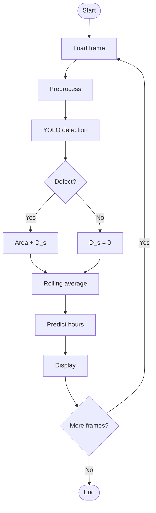
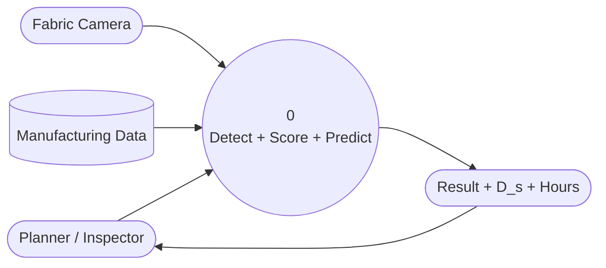
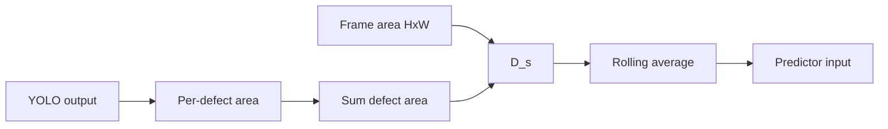
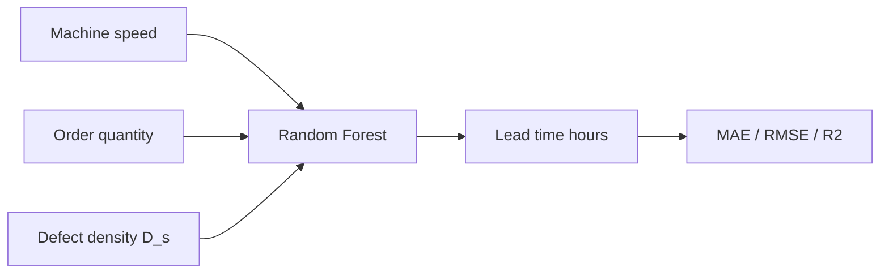
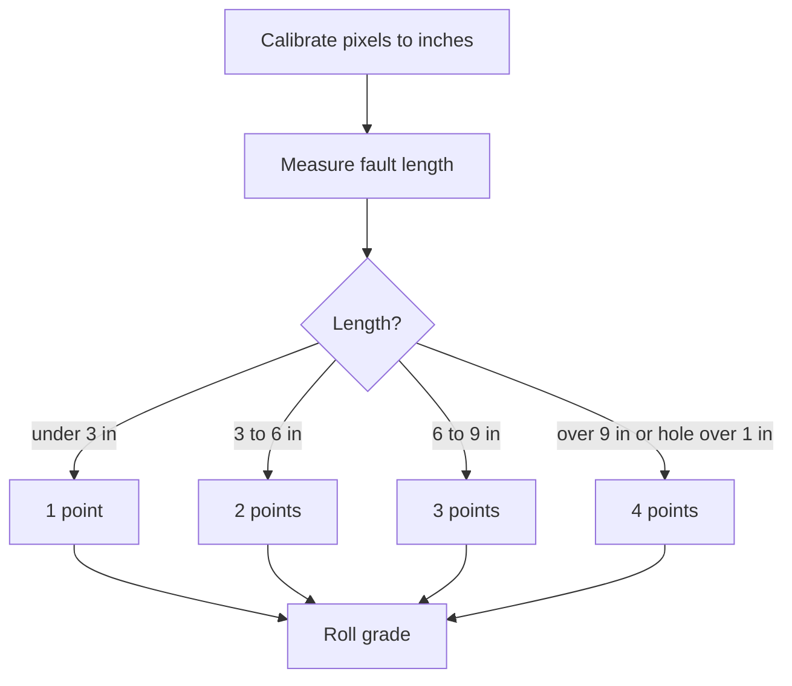
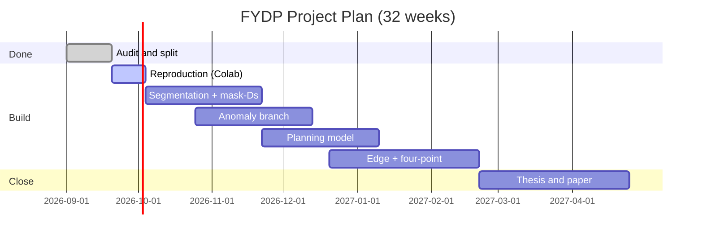

# Unified Fabric Defect Detection and Lead Time Prediction Framework
## A Real-Time Smart Manufacturing System Using YOLO and Machine Learning

**By**

*[Author names and IDs withheld for review — to be added before submission]*

Submitted in partial fulfilment of the requirements
of the degree of Bachelor of Science in Computer Science and Engineering

September, 2026

Department of Computer Science and Engineering
United International University

---

# Abstract

Our task is to build a unified system that detects fabric defects from images and predicts production lead time from the detected quality, for the textile and ready-made garment industry of Bangladesh. Though defect detection systems exist for other industries, in Bangladeshi factories inspection is still largely manual, which is slow, inconsistent, and dependent on inspector experience — while production planning uses fixed lead time tables that ignore real-time fabric quality. This gap between the vision system and the planning system is a threat to delivery reliability and cost control in our largest export sector.

Defect detection is part of computer vision and image processing. It can be used in industrial quality control. Lead time prediction is part of machine learning regression. Together defect detection and lead time prediction form a loop that can be used beyond textiles. Any production line where visible quality affects completion time can benefit. Previous studies had problems: they used small undocumented datasets; they evaluated on duplicated images; they had detection-only systems that did not connect to planning; and they used synthetic planning data that was not tied to real factory conditions. These problems give us a chance to bring improvements.

However previous works faced an issue of no audited corpus with disjoint evaluation. So we will follow the emerging practice of dataset auditing: cryptographically hashing every image removing exact duplicates quarantining cross‑labeled files after visual verification and splitting by fabric group so the same swatch never appears on both sides. Our pilot corpus consists of 2,550 images in 6 classes and our expected target is honest evaluation with mAP‑tracked detection and MAE/RMSE/R²‑tracked planning. For the vision side we will use YOLO family detectors (YOLOv11‑seg target) with image processing for area measurement; for the planning side Random Forest regression with ablations against XGBoost and MLP; for unknown future defects, few‑shot anomaly detection (PatchCore/DINOv2 family).

---

# Acknowledgements

This work would not have been possible without the input and support of many people, over the last two trimesters. We would like to express our gratitude to everyone who contributed to it in some way or other.
First we would like to thank our supervisor for steady guidance, helpful suggestions and constant encouragement during this project.

We are very grateful to the Department of Computer Science and Engineering at United International University for giving us access to laboratory GPUs.

We are very thankful, to the Almighty.

Last but not least we owe our to family, our parents for their unconditional love and huge emotional support.

---

# Table of Contents

Abstract, Acknowledgements, Table of Contents, List of Figures, List of Tables

**1 Introduction** — 1.1 Project Overview; 1.2 Motivation; 1.3 Objectives; 1.4 Methodology; 1.5 Organization of the Report

**2 Background** — 2.1 Preliminaries (2.1.1 Supervised Detection with YOLO; 2.1.2 Segmentation and Area Measurement; 2.1.3 Unsupervised Anomaly Detection; 2.1.4 Ensemble Regression; 2.1.5 Methods and Procedures); 2.2 Literature Review (2.2.1 Works Related to Fabric Datasets; 2.2.2 Works Related to Detection Models; 2.2.3 Works Related to Planning and Production); 2.3 Literature Analysis; 2.4 Summary

**3 Project Design** — 3.1 Requirement Analysis (Functional / Non-functional); 3.2 Methodology and Design; 3.3 Summary

**4 Standards and Design Constraints** — 4.1 Compliance (Software / Hardware / Communication); 4.2 Design Constraints (Economic / Environmental / Ethical / Health and Safety / Social / Political / Manufacturability and Cost / Sustainability); 4.3 Estimated Project Budget; 4.4 Summary

**5 Conclusion** — 5.1 Summary; 5.2 Project Plan; 5.3 Future Work; 5.4 Limitations and Final Remarks

References

# List of Figures

- Figure 2.1: YOLO Detection Principle (grid + boxes + classes)
- Figure 2.2: Defect area measurement (boxes vs masks)
- Figure 2.3: Anomaly detection principle, training on good data
- Figure 2.4: Random Forest ensemble principle
- Figure 3.1: System diagram (`figures/fig31_system.mmd`)
- Figure 3.2: Workflow flowchart (`figures/fig32_workflow.mmd`)
- Figure 3.3: Data flow diagram Level 0 (`figures/fig33_dfd.mmd`)
- Figure 3.4: Metadata bridge for Defect Density Score calculation (`figures/fig34_bridge.mmd`)
- Figure 3.5: Machine learning pipeline for lead time prediction (`figures/fig35_pipeline.mmd`)
- Figure 3.6: Four-point inspection grading logic (`figures/fig36_fourpoint.mmd`)
- Figure 5.1: Project plan Gantt (`figures/fig51_gantt.mmd`)

# List of Tables

- Table 2.1: Literature analysis table
- Table 3.1: Dataset classes and descriptions
- Table 3.2: Audited dataset composition
- Table 3.3: Quarantine ledger (summary)
- Table 3.4: Training and testing split (group-aware manifest)
- Table 3.5: Requirement summary
- Table 3.6: Main project modules
- Table 3.7: Project plan
- Table 3.8: Task allocation
- Table 4.1: Estimated project budget
- Table 4.2: Complex engineering problem mapping
- Table 5.1: Pilot reference numbers (upper bounds)

---

# Chapter 1 — Introduction

## 1.1 Project Overview

Machine learning is a part of Artificial Intelligence that learns from data and computer vision uses it to look at pictures. In textile manufacturing vision watches fabric while machine learning guesses how long production will take. The two work in separate systems. People count how defects there are but they rarely think about how many hours each defect costs. Because of this it is very hard to find data that links quality to time. If we do not create a method to turn what the camera sees into hours that planners can trust factories will keep missing deadlines or adding too many safety buffers. The responsibility, for defects so to speak remains unclear in schedules.

This paper shows a way to bring together YOLO-based fabric defect detection and Random Forest lead‑time prediction using one number the Defect Density Score (D_s).

## 1.2 Motivation

A real situation on our factory floors makes the problem very clear: an inspector notices defects with tired eyes at the end of a shift while the planner next to them promises delivery dates from a table printed last year. This shows that real quality information is disappearing between the inspection board and the planning desk. That is why finding this integration gap is important.

Also the closed loop is helpful in areas: any production line where visible quality affects how long it takes to finish, plus predictive maintenance and estimating waste. The first step we have taken is looking at relevant research papers and our own pilot set of about ~2,550 images. We will create manifests and a dashboard where a planner can see the type of defect D_s and the predicted hours updating in real time.

Data integrity is our challenge. There is no trusted set of data that has been checked beforehand and separated for evaluation. Even though there are problems we have listed every image by hash removed 17 copies and put 12 files that had different labels in quarantine after checking them side by side. The pilot system this proposal builds on had 98% on a split. We see that, as the highest possible result that needs to be tested again honestly not as a final outcome.

## 1.3 Objectives

- Create an audited dataset of fabric images in six classes: hole, horizontal, vertical, lines, stain, defect‑free. Include hash inventory, quarantine ledger and a group‑aware split manifest.
- Build a detector (YOLOv11‑seg target) that outputs the defect type and the pixel‑true area. Track performance with mAP evaluation.
- Build a Random Forest lead time predictor that uses machine speed order quantity and D_s. Measure accuracy, with MAE, RMSE and R² comparing to no‑D_s baselines.
- Combine all modules into a real‑time closed‑loop framework. Provide a planner dashboard.
- Demonstrate that every number is proven on disjoint data: the same swatch family never appears on both sides.

## 1.4 Methodology

Methodology will guide every step of this project. We will train detectors with classification using the YOLO family. Next we will measure area by applying image processing techniques such as thresholding, contour detection and morphological operations before moving on to instance segmentation. We will detect faults by using few‑shot anomaly models like PatchCore and DINOv2 which are trained only on images of good fabric. We will predict remaining hours with a regression approach that combines Random Forest and compares it with XGBoost and MLP. For feature discipline we will apply a rolling‑average D_s smoothing technique. Create seeded reproducible data splits. For user scalability we will build a dashboard that displays to the planner the type of fault its confidence, the D_s value and the predicted hours. Core technologies for this work include Python, Ultralytics YOLO, OpenCV, scikit‑learn and Jetson‑class edge deployment, with TensorRT.

## 1.5 Organization of the Report

Background (tools) Literature Review (20 works, in 3 classes) Project Design (requirements, methodology, diagrams) Standards and Constraints Conclusion (plan, future work).

---

# Chapter 2 — Background

## 2.1 Preliminaries

**2.1.1 Supervised Detection with YOLO.** YOLO treats detection as one regression over an image grid: each cell predicts boxes with confidence plus class probabilities (Redmon et al. 2016). Later versions improved backbone/neck/head; YOLOv8 added segmentation and oriented boxes; YOLOv11s C3k2 block and C2PSA attention help with overlapping objects such, as thin fabric defects. Quality is reported as precision recall F1 and mAP50 mAP50-95. *Figure 2.1 sketches grid → boxes → class.*

**2.1.2 Segmentation and area measurement.** Classic approach: start with grayscale then apply adaptive or Otsu thresholding follow with operations find contours and count pixels to get area_ratio = defect_pixels / frame_pixels. Instance segmentation gives a per-defect mask. This is more accurate for stains. Pulled threads because bounding boxes often overestimate the actual defect size. We use Mask IoU to measure how well the predictions match the ground truth. Our ablation study compares bbox-Ds, versus mask-Ds. That's a part of our experiments. *Figure 2.2 contrasts box vs mask on a stain.*

**2.1.3 Unsupervised Anomaly Detection.** One-class methods train on good fabric. Autoencoders work by reconstruction to mark faults. Reverse Distillation uses student-teacher discrepancy. Has low latency. PatchCore relies on a patch memory bank and achieves 99.6% MVTec AUROC. Few-shot methods like AnomalyDINO and PatchEAD reach 89 to 96% performance with a few good samples and no defect labels. Our few-shot branch is designed for faults. *Figure 2.3 shows the train-on-good → score-novelty logic.*

**2.1.4 Ensemble Regression.** Random Forest (Breiman 2001) uses averaged randomized trees to capture non-linear defect penalties on hours. The metrics used are MAE, RMSE and R² compared against static-mean and no-D_s baselines. *Figure 2.4 shows bagged trees making voting decisions.*

**2.1.5 Methods and Procedures.** Acquisition uses a fixed geometry (640 working resolution); Preprocessing includes Gaussian denoise, motion‑blur modeling and gamma low‑light normalization. Morphological measurement uses calibration for a four‑point grading. Temporal rolling‑average D_s tracks history. Filters false positives. Lead relation: Lead = (Qty/Speed) × 0.1 × (1 + 2 × D_s) — e.g. D_s = 0.2 inflates time 40%.

## 2.2 Literature Review (20 works, 3 classes)

**2.2.1 Works Related to fabric Datasets.** Isl-Knit (Heliyon 2024, BUTEX): 3,375 knit-fault images in 7 classes from Bangladeshi dyeing factories + YOLOv5 + automated four point prototype on Raspberry Pi. FabricSpotDefect (IUB 2024): 1014 images, 3,288 spot annotations across fabric types, COCO+YOLOv8. Globally: ZJU-Leaper (98,777 woven), Tianchi (20 defect types), MVTec AD/VisA for anomalies. Our pilot: 2,578 images in 6 classes with per-file hashes.

**2.2.2 Works Related to Detection Models.** YOLOv1 to YOLOv11 fabric review (2025, YOLOv11 best for small/occluded defects); Fab-ASLKS (+5% mAP50 Tianchi); Fab-ME (+3.3%, 59.4% over 20 classes); FabricMamba edge; PatchCore/RD++/AnomalyDINO/PatchEAD anomaly line; Kumar 2008 classical survey; EfficientDet+Jetson TX2 at 22.7 FPS (2.5x cloud); YOLOv11 on Orin Nano; NEU-DET comparison (YOLOv11 +70% avg).

**2.2.3 Works Related to Planning and Production.** There is no published vision‑Ds lead‑time fusion (our gap). The related work is the CIIS 2024 study on wastage prediction from defective material (633 data points, ANN/SVR/MLP/RFR/ARIMA). Supporting work includes the 2025 BD factory digital‑QC trials that aim to cut defects by 15% and improve DHU by 1.5 to 3 percentage points. Additional monitoring comes from JUKI JaNets. In 2026 a traffic‑light QC study in Narayanganj covers 94 lines. Planning and Production also explore textile parameter prediction.

## 2.3 Literature Analysis

| No. | Paper Name | Method | Dataset | Year |
|-----|------------|--------|---------|------|
| 1 | Kumar fabric survey | Supervised+classical | Collected | 2008 |
| 2 | Isl-Knit + 4-point (BUTEX) | Supervised (YOLOv5) | Own (3,375) | 2024 |
| 3 | FabricSpotDefect (IUB) | Supervised | Own (1,014) | 2024 |
| 4 | YOLOv1–v11 fabric review | Supervised | Collected | 2025 |
| 5 | Fab-ASLKS | Supervised | Tianchi | 2025 |
| 6 | Fab-ME | Supervised | Tianchi (20 cls) | 2024 |
| 7 | FabricMamba edge | Supervised | Own | 2025 |
| 8 | PatchCore | Unsupervised | MVTec/VisA | 2022 |
| 9 | Reverse Distillation (RD++) | Unsupervised | MVTec | 2023 |
| 10 | PatchCore few-shot opt. | Few-shot | MVTec/VisA | 2023 |
| 11 | AnomalyDINO | Few-shot | MVTec | 2025 |
| 12 | PatchEAD | Few/zero-shot | 7 industrial | 2025 |
| 13 | EfficientDet + Jetson TX2 | Supervised | 5 fabric sets | 2021 |
| 14 | YOLOv8 lightweight + edge | Supervised | Own | 2024 |
| 15 | Fabric wastage prediction (CIIS) | Supervised | Own (633) | 2024 |
| 16 | BD RMG digital QC trials | Applied | Factory trials | 2025 |
| 17 | Traffic-light QC Narayanganj | Applied | 94 lines | 2026 |
| 18 | Textile parameter prediction | Supervised | Manufacturing | 2024 |
| 19 | Redmon et al., YOLO | Supervised | VOC/COCO | 2016 |
| 20 | Breiman, Random Forests | Supervised | General | 2001 |

## 2.4 Summary

Supervised detectors cover known defects, anomaly models cover defects, edge tooling shows real-time feasibility, BD datasets give local ground evaluation. And the vision‑to‑hours coupling remains unclaimed: this is the contribution.

---

# Chapter 3 — Project Design

## 3.1 Requirement Analysis

**Table 3.5 — Requirement summary.** Functional: accept fabric image/stream input; preprocess; detect defect type; identify defect-free images; compute area ratio and D_s; predict lead time; display final result. Non-functional: accurate (mAP-tracked); reliable across lighting and textures; efficient real-time processing (≥15 FPS edge target); scalable to new fabrics via few-shot branch; modular and maintainable code with central configuration.

**Table 3.1 — Dataset classes and descriptions:** Hole = missing fabric region, opening, or damaged area; Horizontal = horizontal defect pattern across the fabric surface; Vertical = vertical defect pattern; Line = thin line-like irregularity (incl. pulled threads); Stain = surface contamination, dark mark, or discoloration; Defect-Free = normal fabric without visible defect.

**Table 3.2 — Audited dataset composition:** 2,578 scanned → defect-free 1,505; stain 398; hole 281; lines 157; horizontal 136; vertical 101 → 17 exact duplicates removed → 12 quarantined → **2,549 usable**.

**Table 3.3 — Quarantine ledger (summary):** 9 × hole/line_2018-10-11* + 3 × lines/line_2018-10-10* counterparts — identical swatches cross-labeled hole vs lines, several defect-free (verdict: suspect_cross_label / suspect_batch, excluded from train AND test). hole/20180531* vs lines/20180531* verified CLEAN and retained.

**Table 3.4 — Group-aware manifest (seed 42, test-frac 0.2):** processed families and dated shoots never split across sides; **train 2,081 / test 468, overlap 0**.

## 3.2 Methodology and Design

Supervised YOLO detection; area by image processing → segmentation; unknown faults by few-shot anomaly branch (PatchCore/DINOv2, good-fabric only); hours by Random Forest with XGBoost/MLP ablations; rolling-average D_s smoothing; seeded group-aware splits; planner dashboard (type, confidence, D_s, hours). Core technologies: Python, Ultralytics YOLO, OpenCV, scikit-learn, Jetson-class edge with TensorRT.

**Figure 3.1 — System diagram** (source: `figures/fig31_system.mmd`):

**Figure 3.2 — Workflow flowchart** (source: `figures/fig32_workflow.mmd`):

**Figure 3.3 — Data flow diagram Level 0** (source: `figures/fig33_dfd.mmd`):

**Figure 3.4 — Metadata bridge** (D_s = defect area / frame area, rolling window 10; source: `figures/fig34_bridge.mmd`):

**Figure 3.5 — ML pipeline** (features [speed 20–100, quantity 100–10,000, D_s 0–0.5] → RF 100 trees → hours; source: `figures/fig35_pipeline.mmd`):

**Figure 3.6 — Four-point grading** (source: `figures/fig36_fourpoint.mmd`):

**Table 3.6 — Main modules:** config.py; defect_detection.py; metadata_bridge.py; lead_time_predictor.py; integration.py; scripts/ (inventory, resplit, metrics, reproduce); src/metrics.py.
**Table 3.7 — Project plan:** audit/split (done) → reproduction (Colab weeks 1–2) → segmentation (3–10) → anomaly (8–14) → planning (12–18) → edge (16–24) → write-up (24–32).
**Table 3.8 — Task allocation:** dataset + edge validation; detector training/eval; documentation + planning analysis; integration + deployment; anomaly branch + testing support. (Member-to-task mapping to be fixed at kickoff.)

## 3.3 Summary

Requirements, audited data, modular design and diagrams are fixed. Every number depends on a re-runnable manifest.

---

# Chapter 4 — Standards and Design Constraints

## 4.1 Standards and Design Constraints

**4.1.1 Software Standard.** Software Standard should use packages, a central configuration, version control with reviewable manifests, seeded deterministic training, COCO/YOLO interchange formats and ISO/IEC‑style documentation discipline.

**4.1.2 Hardware Standard.** Hardware Standard requires fixed‑geometry calibration for grading, a Jetson‑class edge device with TensorRT and a factory‑safe power envelope.

**4.1.3 Communication Standard.** Communication Standard uses REST. File handoff to MES, a dashboard, over HTTP and avoids proprietary protocols.

## 4.2 Design Constraints

Economic — The software cost is nothing; the return on investment comes from a decrease in DHU or chargeback costs in 2 to 3 years when the trial results are at expected levels. Environmental — The training requires little data uses very little power at the edge and reduces the number of faulty shipments. Ethical — The cameras are directed at fabric, not workers; any wrong labels are corrected, not ignored; data generated by planning is labeled until the factory records take over. Health and Safety — The systems are enclosed, which helps reduce eye strain. Social — The labels are in Bangla and the inspectors are trained to become supervisors. Political — No approvals are required. Manufacturability and Cost: computers existing; data collection is easy; camera and mount are moderate; Jetson is moderate; deployment is moderate; maintenance is moderate. Sustainability — Open formats are used, the scripts can be maintained, the dataset can be expanded.

## 4.3 Estimated Project Budget

**Table 4.1 — Estimated project budget (BDT):**

| SL | Purpose | Unit Price (BDT) | Amount (BDT) |
|----|---------|-----------------:|-------------:|
| 1 | Fabric swatch collection, procurement and manual verification | 1,500 | 1,500 |
| 2 | Industrial inspection camera (USB 1080p) | 3,500 | 3,500 |
| 3 | Fixed-geometry camera mounting frame / inspection fixture | 1,000 | 1,000 |
| 4 | Calibration materials (scale ruler and grid chart) | 600 | 600 |
| 5 | Department GPU Lab and free cloud computing (Google Colab / Kaggle) | 0 | 0 |
| 6 | Additional GPU computing when free quota is exceeded | 3,000 | 3,000 |
| 7 | Cloud storage for audited dataset and hash-manifest backup (1 year) | 2,400 | 2,400 |
| 8 | Existing laptops / PCs for development and feature engineering | 0 | 0 |
| 9 | Software libraries and machine learning frameworks (YOLO, OpenCV, scikit-learn) | 0 | 0 |
| 10 | Development tools and version control (VS Code, Git/GitHub) | 0 | 0 |
| 11 | Internet connectivity and dataset transfer | 1,500 | 1,500 |
| 12 | Documentation, final report printing, binding and presentation | 2,500 | 2,500 |
| — | **Estimation Total (BDT)** | — | **16,000** |

**Table 4.2 — Complex engineering problem mapping:** Depth — vision, detection/segmentation, anomaly detection, ensemble ML, manufacturing systems; Conflicting requirements — accuracy vs FPS vs edge power; Data complexity — 2 GB heterogeneous images + planning features + noisy labels; Practical impact — QC accuracy and delivery reliability for export orders; Scalability — few-shot branch for new fabrics, per-line replication.

---

# Chapter 5 — Conclusion

## 5.1 Summary

We learned detection using YOLO, segmentation measurement, anomaly detection and ensemble regression. We reviewed 20 works, fixed the requirements and chose the methodology. We also learned the reporting stack. A dataset audit was done — checking hashes, removing 17 duplicates, quarantining 12 files and confirming 2,081 train / 468 test entries. That audit supports everything we did.

## 5.2 Project Plan

Analysis → design → group-aware re-evaluation → YOLOv11-seg plus mask-Ds → anomaly branch → factory-log planning → edge plus four-point → thesis paper. **Figure 5.1 — Project plan Gantt** (source: `figures/fig51_gantt.mmd`):

## 5.3 Future Work

Relabel quarantine using pHash sweep; gather roll-id-disciplined v2 factory data; build a Bangla dashboard; perform benchmarking for Isl-Knit and FabricSpotDefect; submit to a conference. **Table 5.1 (pilot reference, upper bounds):** 98% type accuracy (random split); 5.44 hours reference lead time; 92.0% MAE gain (synthetic); Horizontal → Hole 8%, Hole → Horizontal 7% (Track 2 targets).

## 5.4 Limitations and Final Remarks

Pilot localization is estimated, not measured; planning labels are synthetic and circular; 1,994 files lack group ids so the honest split is partial; minority classes are thin; industrial validation is pending. The framework nevertheless shows defect detection and production planning can live in one intelligent system — a practical direction for automated textile quality control.

---

# References

[1] J. Redmon et al., "You Only Look Once," in *Proc. IEEE CVPR*, 2016. [2] L. Breiman, "Random Forests," *Machine Learning*, vol. 45, 2001. [3] A. Kumar, "Vision-based fabric defect detection: A survey," *IEEE TIE*, vol. 55, 2008. [4] A. Das Gupta et al., "Isl-Knit," *Heliyon*, vol. 10, no. 17, 2024. [5] F. Islam et al., "FabricSpotDefect," *Data in Brief*, 2024. [6] M. Mao et al., "YOLOv1–v11 fabric review," 2025. [7] S. Wang et al., "Fab-ASLKS," *arXiv:2501.14190*, 2025. [8] "Fab-ME," 2024. [9] J. Santos et al., "Optimizing PatchCore few-shot," *arXiv:2307.10792*, 2023. [10] T. Tran Dinh et al., "Revisiting reverse distillation," in *Proc. IEEE CVPR*, 2023. [11] S. Damm et al., "AnomalyDINO," in *Proc. IEEE WACV*, 2025. [12] "PatchEAD," 2025. [13] S. Song et al., "EfficientDet + Jetson TX2," 2021. [14] D. P. Kulugammana et al., "Fabric wastage prediction," in *Proc. CIIS*, 2024. [15] A. Maity and T. Ghosh, "Surface defect detection comparison," *arXiv:2510.21811*, 2025. [16] F. He et al., "Fabric defect detection review," *J. Textile Institute*, vol. 117, 2026. [17] R. Roth et al., "PatchCore," in *Proc. IEEE CVPR*, 2022. [18] H. Habib et al., "Traffic-light QC in BD RMG," *JTEFT*, vol. 12, no. 1, 2026. [19] Y. LeCun, Y. Bengio, and G. Hinton, "Deep learning," *Nature*, vol. 521, 2015. [20] I. Goodfellow, Y. Bengio, and A. Courville, *Deep Learning*, MIT Press, 2016.
